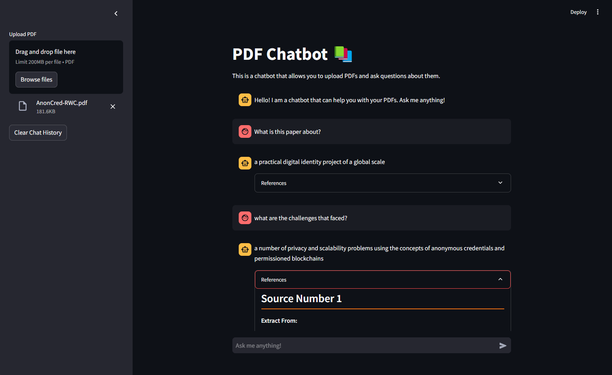

# PDF Chatbot using Streamlit



This is a PDF chatbot that use RAG approach

### Poetry
To run the application you would need to install `poetry`

Refer to [official website](https://python-poetry.org/docs/) to download poetry 

After installing run the code below to start

```
poetry install
```

```
poetry run streamlit run app.py
```

### Docker
If you don't want to download poetry, you can also use docker container to run this application. follow the step below:
1. Make sure you install docker desktop & login
2. Create a docker image first:
```
docker build -t <your_username>/<image_name>:<tag> .
```
3. Build the container:
```
docker run -p 8501:8501 <your_username>/<image_name>:<tag>
```